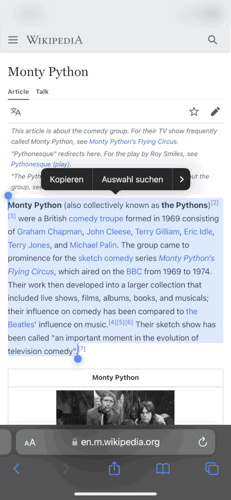

# Clipboard Reader

Clipboard Reader is a Pythonista program to read out not whole pages but just the part you want. Great when you ability to focus is low.

## How to Use

Copy the text you want to be read to you, run main.py and the text's language will be detected, a voice will be chosn accordingly. The text will be read in blocks (paragraphs) and also displayed in a simple ui. Use the stop button to abort.

### Voice Preferences

If you have prefered voices store the names in the VOICE_PREFERENCES list in preferences.py.
The first match of name and text language will be used.

### Speed Preference

Speaking rate is set to .55. Feel free to change in preferences.py. Rate can be any float from 0 to 1.

### Sharing Extension

Add main.py to your Pythonista Shortcuts for Apple's Sharing Extention to run this code from anywhere you find readable text.

